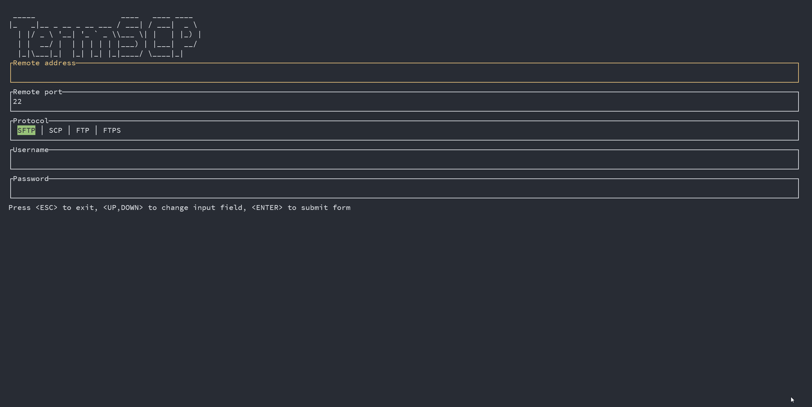
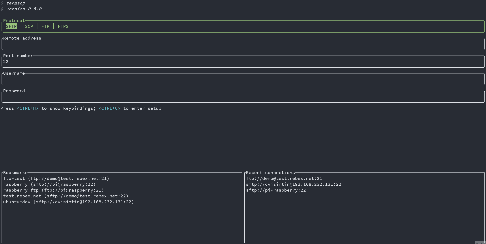
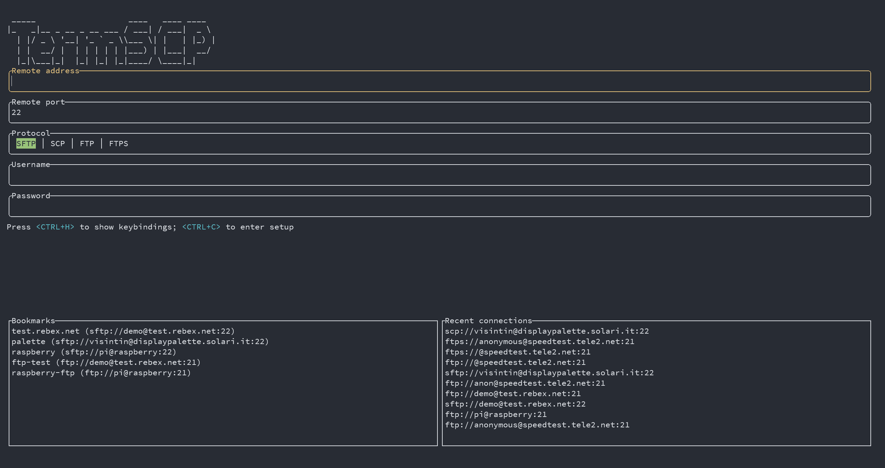
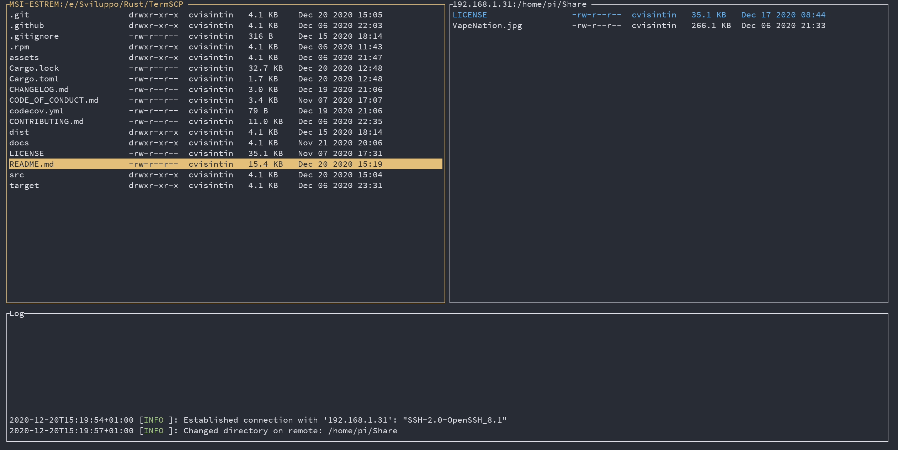

# termscp

<p align="center">
  
</p>

<p align="center">~ A feature rich terminal file transfer ~</p>
<p align="center">
  <a href="https://veeso.github.io/termscp/" target="_blank">Website</a>
  ·
  <a href="https://veeso.github.io/termscp/#get-started" target="_blank">Installation</a>
  ·
  <a href="https://veeso.github.io/termscp/#user-manual" target="_blank">User manual</a>
</p>

<p align="center">
  <a href="https://github.com/veeso/termscp"
    ></a>
  &nbsp;
  <a
    href="/docs/de/README.md"
    ></a>
  &nbsp;
  <a
    href="/docs/es/README.md"
    ></a>
  &nbsp;
  <a
    href="/docs/fr/README.md"
    ></a>
  &nbsp;
  <a
    href="/docs/it/README.md"
    ></a>
  &nbsp;
  <a
    href="/docs/zh-CN/README.md"
    ></a>
</p>

<p align="center">Developed by <a href="https://veeso.github.io/" target="_blank">@veeso</a></p>
<p align="center">Current version: 0.7.0 (12/10/2021)</p>

<p align="center">
  <a href="https://opensource.org/licenses/MIT"
    ></a>
  &nbsp;
  <a href="https://github.com/veeso/termscp/stargazers"
    ></a>
  &nbsp;
  <a href="https://crates.io/crates/termscp"
    ></a>
  &nbsp;
  <a href="https://crates.io/crates/termscp"
    ></a>
</p>
<p align="center">
  <a href="https://github.com/veeso/termscp/actions"
    ></a>
  &nbsp;
  <a href="https://github.com/veeso/termscp/actions"
    ></a>
  &nbsp;
  <a href="https://github.com/veeso/termscp/actions"
    ></a>
  &nbsp;
  <a href="https://github.com/veeso/termscp/actions"
    ></a>
  &nbsp;
  <a href="https://coveralls.io/github/veeso/termscp"
    ></a>
  &nbsp;
  <a href="https://docs.rs/termscp"
    ></a>
  &nbsp;
</p>

---

## About termscp 🖥

Termscp is a feature rich terminal file transfer and explorer, with support for SCP/SFTP/FTP/S3. So basically is a terminal utility with an TUI to connect to a remote server to retrieve and upload files and to interact with the local file system. It is **Linux**, **MacOS**, **FreeBSD** and **Windows** compatible.


---

## Features 🎁

- 📁  Different communication protocols
  - **SFTP**
  - **SCP**
  - **FTP** and **FTPS**
  - **Aws S3**
- 🖥  Explore and operate on the remote and on the local machine file system with a handy UI
  - Create, remove, rename, search, view and edit files
- ⭐  Connect to your favourite hosts through built-in bookmarks and recent connections
- 📝  View and edit files with your favourite applications
- 💁  SFTP/SCP authentication with SSH keys and username/password
- 🐧  Compatible with Windows, Linux, FreeBSD and MacOS
- 🎨  Make it yours!
  - Themes
  - Custom file explorer format
  - Customizable text editor
  - Customizable file sorting
  - and many other parameters...
- 📫  Get notified via Desktop Notifications when a large file has been transferred
- 🔐  Save your password in your operating system key vault
- 🦀  Rust-powered
- 👀  Developed keeping an eye on performance
- 🦄  Frequent awesome updates

---

## Get started 🚀

If you're considering to install termscp I want to thank you 💜 ! I hope you will enjoy termscp!  
If you want to contribute to this project, don't forget to check out our [contribute guide](CONTRIBUTING.md).

If you are a Linux, a FreeBSD or a MacOS user this simple shell script will install termscp on your system with a single command:

```sh
curl --proto '=https' --tlsv1.2 -sSLf "https://git.io/JBhDb" | sh
```

while if you're a Windows user, you can install termscp with [Chocolatey](https://chocolatey.org/):

```sh
choco install termscp
```

For more information or other platforms, please visit [veeso.github.io](https://veeso.github.io/termscp/#get-started) to view all installation methods.

⚠️ If you're looking on how to update termscp just run termscp from CLI with: `(sudo) termscp --update` ⚠️

### Requirements ❗

- **Linux** users:
  - libssh
  - libdbus-1
  - pkg-config
- **FreeBSD** users:
  - libssh
  - dbus
  - pkgconf

### Optional Requirements ✔️

These requirements are not forced required to run termscp, but to enjoy all of its features

- **Linux/FreeBSD** users:
  - To **open** files via `V` (at least one of these)
    - *xdg-open*
    - *gio*
    - *gnome-open*
    - *kde-open*
- **Linux** users:
  - A keyring manager: read more in the [User manual](docs/man.md#linux-keyring)
- **WSL** users
  - To **open** files via `V` (at least one of these)
    - [wslu](https://github.com/wslutilities/wslu)

---

## Support me ☕

If you like termscp and you'd love to see the project to grow and to improve, please consider a little donation to support me on **Buy me a coffee** 🥳

[](https://www.buymeacoffee.com/veeso)

---

## User manual and Documentation 📚

The user manual can be found on the [termscp's website](https://veeso.github.io/termscp/#user-manual) or on [Github](docs/man.md).

The developer documentation can be found on Rust Docs at <https://docs.rs/termscp>

---

## Known issues 🧻

- `NoSuchFileOrDirectory` on connect (WSL1): I know about this issue and it's a glitch of WSL I guess. Don't worry about it, just move the termscp executable into another PATH location, such as `/usr/bin`, or install it through the appropriate package format (e.g. deb).

---

## Upcoming Features 🧪

Major termscp releases will now be seasonal, so expect 4 major updates during the year.

Planned for *❄️ Winter update 2021 ⛄*:

- **File system watcher 🔭**: The feature consists in the possibility to track some files in order to automatically sync them with remote host. For the implementation [notify](https://github.com/notify-rs/notify) will be used.
- **Translations 🌐**: The feature consists in the possibility for the user to install the language pack for the language he prefers in order to replace the default English interface. The following language will be provided along to English:
  - 🇨🇳 Chinese
  - 🇫🇷 French
  - 🇩🇪 German
  - 🇮🇹 Italian
  - 🇳🇱 Dutch
  - 🇪🇸 Spanish

Planned for *🍓 Spring update 2022 🌹*:

- **SMB Support 🎉**: This will require a long time to be implemented, since I'm currently working on a Rust native SMB library, since I don't want to add new C-bindings. ~~Fear the 🦚~~
- **Configuration profile for bookmarks 📚**: Basically this feature adds the possibility to have a specific setup for a certain host, instead of having only one global configuration. (Maybe will be postponed to spring 2022).

Along to new features, termscp developments is now focused on UX and performance improvements, so if you have any suggestion, feel free to open an issue.

---

## Contributing and issues 🤝🏻

Contributions, bug reports, new features and questions are welcome! 😉
If you have any question or concern, or you want to suggest a new feature, or you want just want to improve termscp, feel free to open an issue or a PR.

An **appreciated** contribution would be a translation of the user manual and readme in **other languages**

Please follow [our contributing guidelines](CONTRIBUTING.md)

---

## Changelog ⏳

View termscp's changelog [HERE](CHANGELOG.md)

---

## Powered by 💪

termscp is powered by these awesome projects:

- [bytesize](https://github.com/hyunsik/bytesize)
- [crossterm](https://github.com/crossterm-rs/crossterm)
- [edit](https://github.com/milkey-mouse/edit)
- [keyring-rs](https://github.com/hwchen/keyring-rs)
- [open-rs](https://github.com/Byron/open-rs)
- [rpassword](https://github.com/conradkleinespel/rpassword)
- [rust-s3](https://github.com/durch/rust-s3)
- [self_update](https://github.com/jaemk/self_update)
- [ssh2-rs](https://github.com/alexcrichton/ssh2-rs)
- [suppaftp](https://github.com/veeso/suppaftp)
- [textwrap](https://github.com/mgeisler/textwrap)
- [tui-rs](https://github.com/fdehau/tui-rs)
- [tui-realm](https://github.com/veeso/tui-realm)
- [whoami](https://github.com/libcala/whoami)
- [wildmatch](https://github.com/becheran/wildmatch)

---

## Gallery 🎬

> Termscp Home



> Bookmarks



> Setup



> Text editor



---

## License 📃

termscp is licensed under the MIT license.

You can read the entire license [HERE](LICENSE)
