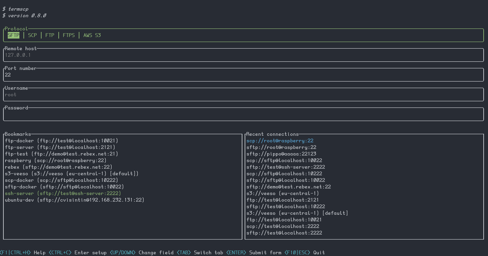
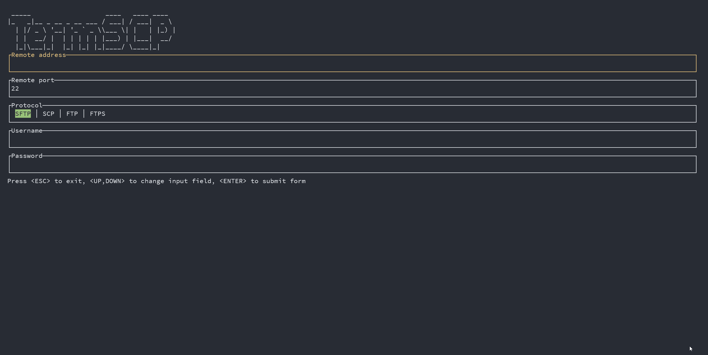
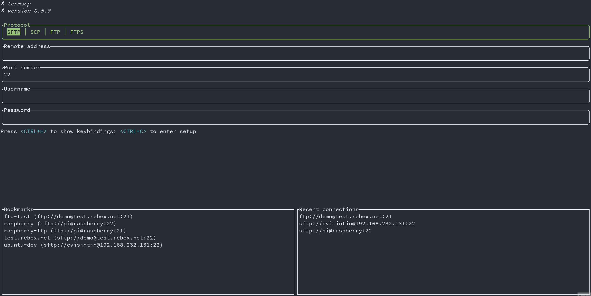
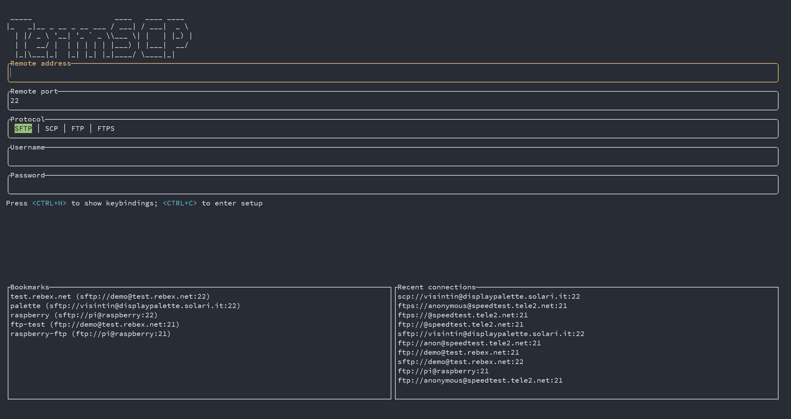
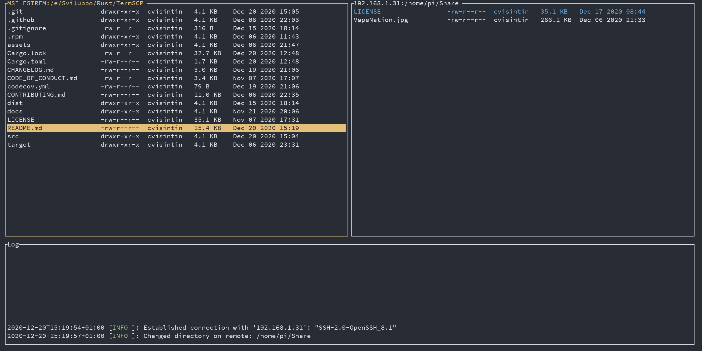

# termscp

<p align="center">
  
</p>

<p align="center">~ A feature rich terminal file transfer ~</p>
<p align="center">
  <a href="https://termscp.rs" target="_blank">Website</a>
  ·
  <a href="https://termscp.rs/install" target="_blank">Installation</a>
  ·
  <a href="https://docs.termscp.rs" target="_blank">User manual</a>
</p>

<p align="center">
  <a
    href="/docs/zh-CN/README.md"
    ></a>
</p>

<p align="center">Developed by <a href="https://veeso.me/" target="_blank">@veeso</a></p>
<p align="center">Current version: 1.0.0 2026-04-18</p>

<p align="center">
  <a href="https://opensource.org/licenses/MIT"
    ></a>
  <a href="https://github.com/veeso/termscp/stargazers"
    ></a>
  <a href="https://crates.io/crates/termscp"
    ></a>
  <a href="https://crates.io/crates/termscp"
    ></a>
</p>
<p align="center">
  <a href="https://github.com/veeso/termscp/actions/workflows/linux.yml"
    ></a>
  <a href="https://github.com/veeso/termscp/actions/workflows/macos.yml"
    ></a>
  <a href="https://github.com/veeso/termscp/actions/workflows/windows.yml"
    ></a>
</p>

---

## About termscp 🖥

Termscp is a feature rich terminal file transfer and explorer, with support for SCP/SFTP/FTP/Kube/S3/WebDAV. So basically is a terminal utility with an TUI to connect to a remote server to retrieve and upload files and to interact with the local file system. It is **Linux**, **MacOS**, **FreeBSD**, **NetBSD** and **Windows** compatible.



---

## Features 🎁

- 📁  Different communication protocols
  - **SFTP**
  - **SCP**
  - **FTP** and **FTPS**
  - **Kube**
  - **S3**
  - **SMB**
  - **WebDAV**
- 🖥  Explore and operate on the remote and on the local machine file system with a handy UI
  - Create, remove, rename, search, view and edit files
- ⭐  Connect to your favourite hosts through built-in bookmarks and recent connections
- 📝  View and edit files with your favourite applications
- 💁  SFTP/SCP authentication with SSH keys and username/password
- 🐧  Compatible with Windows, Linux, FreeBSD, NetBSD and MacOS
- 🐚  Embedded terminal for executing commands on the system.
- 🎨  Make it yours!
  - Themes
  - Custom file explorer format
  - Customizable text editor
  - Customizable file sorting
  - and many other parameters...
- 📫  Get notified via Desktop Notifications when a large file has been transferred
- 🔭  Keep file changes synchronized with the remote host
- 🔐  Save your password in your operating system key vault
- 🦀  Rust-powered
- 👀  Developed keeping an eye on performance
- 🦄  Frequent awesome updates

---

## Get started 🚀

If you're considering to install termscp I want to thank you 💜 ! I hope you will enjoy termscp!  
If you want to contribute to this project, don't forget to check out our [contribute guide](CONTRIBUTING.md).

If you are a Linux, a FreeBSD or a MacOS user this simple shell script will install termscp on your system with a single command:

```sh
curl --proto '=https' --tlsv1.2 -sSLf https://termscp.rs/install.sh | sh
```

> ❗ MacOs installation requires [Homebrew](https://brew.sh/), otherwise the Rust compiler will be installed

if you're a Windows user, you can install termscp from PowerShell with a single command:

```ps
irm https://termscp.rs/install.ps1 | iex
```

or, alternatively, with [Chocolatey](https://chocolatey.org/):

```ps
choco install termscp
```

NetBSD users can install termscp from the official repositories.

```sh
pkgin install termscp
```

Arch Linux users can install termscp from the official repositories.

```sh
pacman -S termscp
```

For more information or other platforms, please visit [termscp.rs](https://termscp.rs/install) to view all installation methods.

⚠️ If you're looking on how to update termscp just run termscp from CLI with: `(sudo) termscp update` ⚠️

### Requirements ❗

- **Linux** users:
  - libdbus-1
  - pkg-config
  - libsmbclient
- **FreeBSD** or, **NetBSD** users:
  - dbus
  - pkgconf
  - libsmbclient

### Optional Requirements ✔️

These requirements are not forced required to run termscp, but to enjoy all of its features

- **Linux/FreeBSD** users:
  - To **open** files via `V` (at least one of these)
    - *xdg-open*
    - *gio*
    - *gnome-open*
    - *kde-open*
- **Linux** users:
  - A keyring manager: read more in the [User manual](https://docs.termscp.rs/en-US/configuration/password-security.html#linux-keyring)
- **WSL** users
  - To **open** files via `V` (at least one of these)
    - [wslu](https://github.com/wslutilities/wslu)

---

## User manual 📚

The user manual can be found on [termscp's documentation website](https://docs.termscp.rs).

---

## Upcoming Features 🧪

See [Milestones](https://github.com/veeso/termscp/milestones)

---

## Contributing and issues 🤝🏻

Contributions, bug reports, new features and questions are welcome! 😉
If you have any question or concern, or you want to suggest a new feature, or you want just want to improve termscp, feel free to open an issue or a PR.

An **appreciated** contribution would be a translation of the user manual and readme in **other languages**

Please follow [our contributing guidelines](CONTRIBUTING.md)

---

## Changelog ⏳

View termscp's changelog [HERE](CHANGELOG.md)

---

## Powered by 💪

termscp is powered by these awesome projects:

- [bytesize](https://github.com/hyunsik/bytesize)
- [crossterm](https://github.com/crossterm-rs/crossterm)
- [edit](https://github.com/milkey-mouse/edit)
- [keyring-rs](https://github.com/hwchen/keyring-rs)
- [kube](https://github.com/kube-rs/kube)
- [open-rs](https://github.com/Byron/open-rs)
- [pavao](https://github.com/veeso/pavao)
- [remotefs](https://github.com/veeso/remotefs-rs)
- [rpassword](https://github.com/conradkleinespel/rpassword)
- [self_update](https://github.com/jaemk/self_update)
- [ratatui](https://github.com/ratatui-org/ratatui)
- [tui-realm](https://github.com/veeso/tui-realm)
- [whoami](https://github.com/libcala/whoami)
- [wildmatch](https://github.com/becheran/wildmatch)

---

## Gallery 🎬

> Termscp Home



> Bookmarks



> Setup



> Text editor



---

## License 📃

termscp is licensed under the MIT license.

You can read the entire license [HERE](LICENSE)
